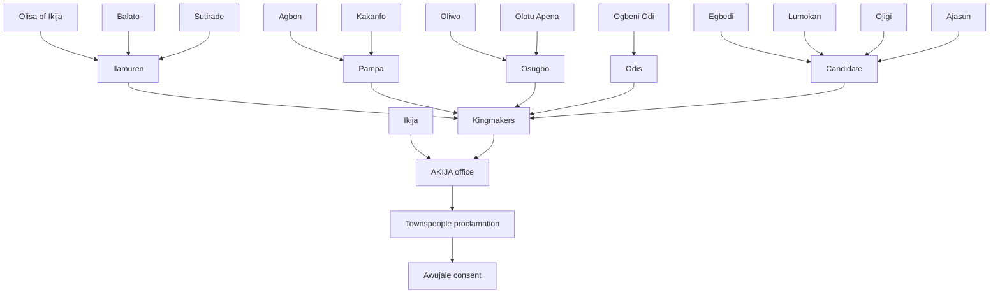

# Ikija Constitutional Topology

```mermaid
graph TD
  IKIJA[Ikija] --> AKIJA[AKIJA office]

  EGBEDI[Egbedi] --> CAND[Candidate]
  LUMOKAN[Lumokan] --> CAND
  OJIGI[Ojigi] --> CAND
  AJASUN[Ajasun] --> CAND

  OLISA[Olisa of Ikija] --> ILAMUREN[Ilamuren]
  BALATO[Balato] --> ILAMUREN
  SUTIRADE[Sutirade] --> ILAMUREN

  AGBON[Agbon] --> PAMPA[Pampa]
  KAKANFO[Kakanfo] --> PAMPA

  OLIWO[Oliwo] --> OSUGBO[Osugbo]
  APENA[Olotu Apena] --> OSUGBO

  OGBENI[Ogbeni Odi] --> ODI[Odis]

  ILAMUREN --> KINGMAKERS[Kingmakers]
  PAMPA --> KINGMAKERS
  OSUGBO --> KINGMAKERS
  ODI --> KINGMAKERS

  CAND --> KINGMAKERS
  KINGMAKERS --> AKIJA
  AKIJA --> TOWN[Townspeople proclamation]
  TOWN --> AWUJALE[Awujale consent]
```

This diagram is a process/topology aid, not a claim that every node forms a single rank hierarchy.
